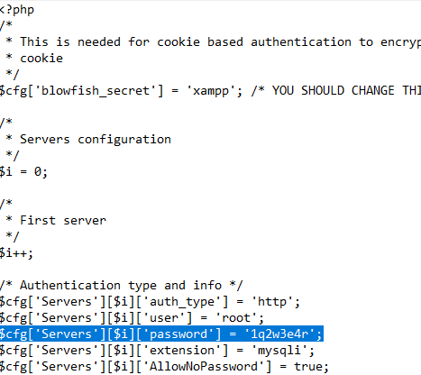
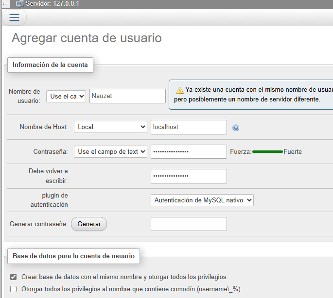

## Config phpmyadmin
### Pasos
1. cambiar la configuración de usuario desde phpmyadmin para poner contraseña al usuario root
2. En el archivo config.inc.php modificar y poner en la linea $cfg['Servers'][$i]['password'] = ''; en las comillas poner la contraseña que le pusiste

3. entrar en phpmyadmin y crear un nuevo usuario entrar en cuentas de usuarios y crear un usuario en nombre de host poner Local en base de datos de la cuenta seleccionar el primero y permisos globales darle Datos y Estructura

4. ya tenemos el usuario creado ahora entramos otra vez en el archivo config.inc.php y cambiamos la linea
$cfg['Servers'][$i]['auth_type'] = 'config'; y ponemos http y quitamos config quedaria $cfg['Servers'][$i]['auth_type'] = 'http';

