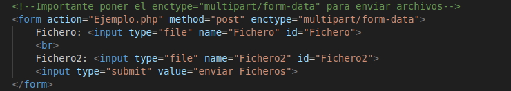

## Get-Post
### Pasos para get
1. Crear un archivo php con estructura html con un form con method = "get"
Ej:

2. Crear un archivo php con estructura php 

3. Con $_GET obtienes todo lo que se envie por metodo get

4. con $_GET['Usuario'] en este caso Usuario seria la id que pusimos en el input y te traeria el valor de esa variable importante que no se repitan las ids
EJ:

### Pasos para post
1. Crear un archivo php con estructura html con un form con method = "post"
Ej:

2. Crear un archivo php con estructura php 

3. Con $_POST obtienes todo lo que se envie por metodo post

4. con $_POST['Fichero'] en este caso Fichero seria la id que pusimos en el input y te traeria el valor de esa variable importante que no se repitan las ids
EJ:

